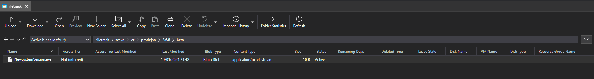
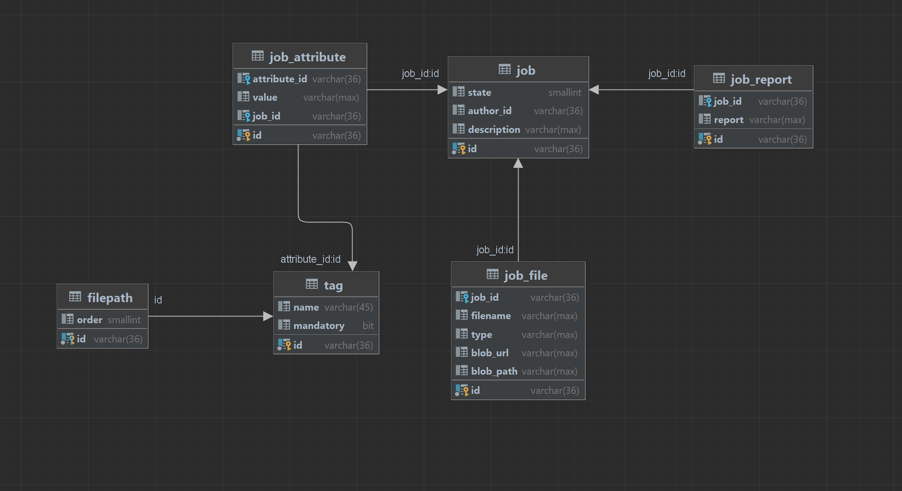
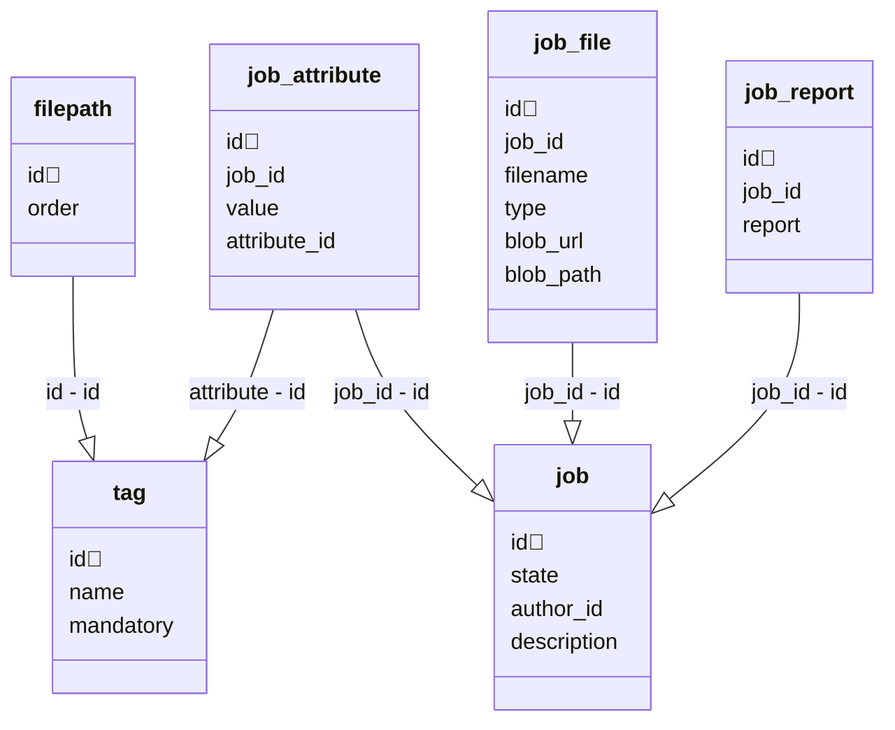

# FiletrackApi

## Úvod
- Filetrack slouží jako správce vydávaných verzí různých softwarových produktů, využívá k tomu 3 hlavní role Developer, Tester a Technician.
- Projekt využívá je vytvořen na architektuře mikroservis. Aktuálně obsahuje dvě části Filetrack Api a Filetrack Web Interface.
  Nasazení projektu bude provedeno pomocí dockerových kontejnerů spuštěných v docker-compose. V docker-compose bude běžet i databáze, kterou projekt využívá.
  K Filetrack Api budou mít přístup pouze programy běžící ve stejném dockeru a tím bude zajištěna bezpečnost vnitřní komunikace mezi jednotlivými částmi projektu.
  Ven na internet je Filetrack Api přístupné pouze přes další části jako je právě Web Interface. V budoucnu je v plánu pomocí další mikroservisy udělat propojení s github actions.
- Filetrack Api je hlavní součást projektu, která má na starost hlavní logiku, která obsluhuje databázi a cloudové úložiště v Azure Blob Storage. Aplikace je psána v C# Asp net 7.0 .

### Propojení s ostatními prvky projektu
- S Filetrack Api ostatní části komunikují pomocí http requestů. Requesty obsahují modely requestů, které definují strukturu toho co a v jakém formátu má přijít. 

### Databáze
- Pro komunikací s databází je použit nuget SqlClient od Microsoftu. Zbytku aplikace zprostředkovává databází třída DbService, která implementuje interface IDbService.

### Azure Blob Storage
- S Blob storagem komunikuje aplikace za pomoci nugetu Azure.Storage.Blobs. . 
Základní funkce této knihovny zprostředkovává třída AzureBlobServic, která umožňuje provádět klasické CRUD operace nad soubory v cloudu.

### Job uložený v azure blob storage

### Diagram databáze

### Mermaid-js diagram databáze

### Užitečné odkazy:
- https://www.ibm.com/docs/en/sgfmw/5.3.1?topic=setup-adding-users-setting-permissions-sql-database
- https://learn.microsoft.com/en-us/answers/questions/1033258/download-file-in-c-net-core
- https://blog.aspose.com/zip/create-zip-archives-add-files-or-folders-to-zip-in-csharp-asp.net/
- https://learn.microsoft.com/en-us/azure/storage/blobs/storage-blob-download

## Autor: Jaroslav Němec T3 SSAKHK 2023/2024

